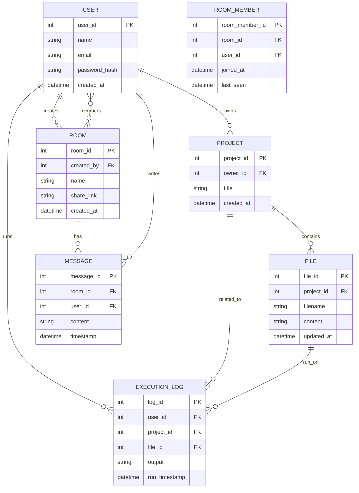

# 🧩 MeowCollab – Real-Time Collaborative Code Editor

## 🚀 Overview
MeowCollab is a full-stack web platform that enables developers, students, and teams to write, run, and collaborate on code in real time — directly from their browsers.

It combines a powerful live code editor, secure backend execution, and instant synchronization, making it perfect for:
- Pair programming
- Coding interviews
- Hackathons
- Online classrooms

---

## ⚙️ Core Features

### 🧠 1. Real-Time Collaborative Editor
- Multiple users can edit the same file simultaneously  
- Live cursor tracking and syntax highlighting  
- Built using **Socket.IO** for low-latency updates  
- Instant synchronization across all connected users  

### 💻 2. Code Execution (Multi-Language Support)
- Supports **JavaScript, Python, C, C++, and Java**
- Executes code securely in **Docker containers**
- Real-time output and error logs in an integrated console

### 👥 3. User Authentication & Rooms
- Secure login / sign-up using email & password
- Create or join collaborative rooms via shareable links
- Session management via **JWT (JSON Web Token)**

### 💾 4. Project & File Management
- Create and organize files/folders inside projects
- Autosave progress using **Prisma ORM**
- Share project URLs with collaborators

### 💬 5. Built-in Chat & Presence
- Real-time chat inside each workspace
- See which users are currently online and editing

### 🎨 6. Modern Developer Interface
- Clean, responsive UI with dark theme
- Built with **React + Vite + Tailwind CSS**
- Editor powered by **Monaco Editor (VS Code)**

---

## 🧱 Tech Stack

| Layer | Technology |
|------|------------|
| **Frontend** | React (Vite), Tailwind CSS, Monaco Editor |
| **Backend** | Node.js (Express), Prisma ORM |
| **Database** | MySQL / PostgreSQL |
| **Real-time Communication** | Socket.IO |
| **Code Execution** | Docker Sandbox |
| **Authentication** | JWT (JSON Web Token) |
| **Deployment** | Vercel (Frontend) + Railway / Render (Backend) |

---

## 🧩 Project Architecture

```text
frontend/
├─ src/
│  ├─ components/
│  ├─ pages/
│  ├─ context/
│  └─ utils/
├─ package.json
└─ vite.config.js

backend/
├─ src/
│  ├─ routes/
│  ├─ controllers/
│  ├─ services/
│  ├─ prisma/
│  └─ utils/
├─ Dockerfile
├─ package.json
└─ server.js
```

## 🗄️ ER Diagram



